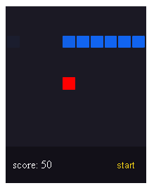

# Jogo da cobrinha
<p align="center">O famoso jogo da cobrinha que você jogava no Motorola tijolão :)</p>
<h4 align="center"> Status do projeto: completo</h4>

### Tabela de conteudo

<p align="center">
<a href="#funcionalidades">funcionalidades</a> • 
<a href="#Demostração-da-Aplicação">Demostração</a> • 
<a href="#Como-executar-o-projeto">como Executar</a> • 
<a href="#Tecnologias-utilizadas">Tecnologias</a> •   
<a href="#autor">Autor</a> •
<a href="#licenc-a">Licença</a> 
</p>

### funcionalidades

####!movimento pelas tecLas: W,A,S,D!

- [x] matriz usando tabela
- [x] Movimentação da cobra
- [x] Gerar a maça aleatória
- [x] fazer a cobra crescer e acompanhar a cabeça

### Demostração da Aplicação
<br>
<a href="https://bsantuz.github.io/snake-game/">Teste a aplicação<a>


### Como executar o projeto
Antes de começar, você vai precisar ter instalado em sua máquina um editor para trabalhar com o código como [VSCode](https://code.visualstudio.com/)

```bash
# Clone este repositório
$ git clone <>

# Acesse a pasta do projeto no terminal/cmd
$ cd ...

# Execute a aplicação 
$ index.html ou server live(plugin do vscode)

```
         

### Tecnologias utilizadas


### Autor
Feito com ❤️ por Bruno Santuz 👋🏽 Entre em contato!

email: brunobruno2000@hotmail.com

### Licença
MIT License
